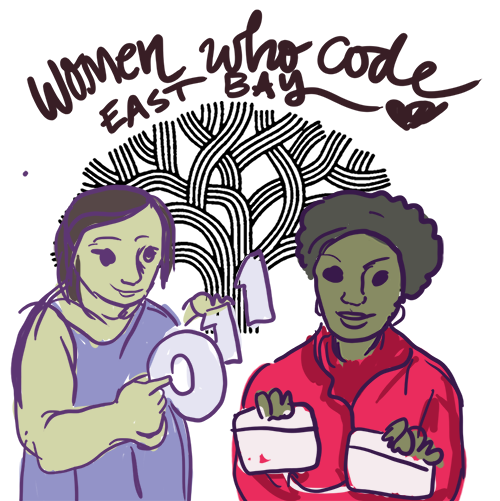

# Women Who Code Oakland Node.js Tutorial

This is a basic tutorial on Node.js using the command line.
Benefits:

* You can make a basic "networked" app
* You can avoid doing clerical gruntwork and using horrible Excel Macros

written by a javascript newbie for Women Who Code Oakland / Women Who Code East Bay [http://www.meetup.com/Women-Who-Code-East-Bay/](http://www.meetup.com/Women-Who-Code-East-Bay/)

_Women dominate clerical, lower-paid clerical jobs like entry level accounting and secretarial work or lower-level marketing positions. They live their lives in Excel sheets. Enabling them to learn basic coding and taking advantage of their intelligence and potential will help make the world a better place._

# Tutorial Copy

// TODO!!!

# Tutorial Samples
	
	node app.js oakland_service
	
Not so fun! Examining domestic violence incidents in Oakland in the past 90 days  [OpenData Oakland](https://data.oaklandnet.com/Public-Safety/CrimeWatch-Maps-Past-90-Days/ym6k-rx7a)

	$ node app oakland_domestic_violence
	>>> results...
	Oakland Crimewatch - the past 90 days
	Police Precinct 26Y : 2 domestic violence incidents
	Police Precinct 27Y : 11 domestic violence incidents
	Police Precinct 34X : 8 domestic violence incidents
// etc
	
	
Getting a raw feed of the Oakland 2015-2016 budget from [OpenData Oakland](https://data.oaklandnet.com)

	node app.js oakland_budget

Result example: there were this many budget requests

	City Council : $8366025
	Mayor : $5708475
	City Administrator : $43098749
	

## Public Data for Oakland

For tutorials and students we can practice on the Oakland Open Data sets. [https://data.oaklandnet.com](https://data.oaklandnet.com)

* Teach people how to find the sample JSON Endpoint
* Teach people how to get a secret token, etc and add it to their project
* Help people put this in a web console interview

